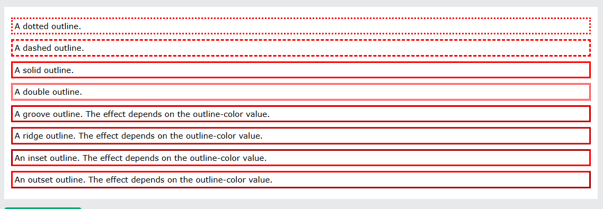
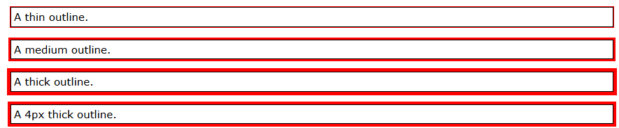

# CSS Property
## Selector
**element Selector**
```css
p {
  text-align: center;
  color: red;
}
```

**id Selector**
```css
#para1 {
  text-align: center;
  color: red;
}
```

**class Selector**
```css
.center {
  text-align: center;
  color: red;
}
```

## Color
**background-color**: backgroud for HTML element
**color**: color of the text
**border**: color of borders (```border: 2px solid red```)
**color value**: rgb(255, 99, 71), ##ff6347, hsl(9, 100%, 64%)

## Backgrounds

**background-color**: background color of an element
**opacity**: transparent of an element (0.0-1.0)

transparency with RGBA
```css
div {
  background: rgba(0, 128, 0, 0.3) /* Green background with 30% opacity */
}
```
**background-image**: ```url("paper.gif");```

**background-repeat**:
- repeat-x: repeated horizontally
- repeat-y: repeated vertically
- no-repeat: showing the background image only once

**background-position**:
- left top
- left center
- left bottom
- right top
- right center
- right bottom
- center top
- center center (default)
- center bottom

**background-attachment**: should scroll or be fixed; 

## Borders
**border-style**:
- dotted - Defines a dotted border
- dashed - Defines a dashed border
- solid - Defines a solid border
- double - Defines a double border
- groove - Defines a 3D grooved border. The effect depends on the border-color value
- ridge - Defines a 3D ridged border. The effect depends on the border-color value
- inset - Defines a 3D inset border. The effect depends on the border-color value
- outset - Defines a 3D outset border. The effect depends on the border-color value
- none - Defines no border
- hidden - Defines a hidden border

**border-width**: width of four borders of specific size(in px, pt, cm, em, etc) or thin, medium or think
- can have one to four value (top, right, bottom, left)

**border-color**: set color of four borders
**border-sides**: 
```css
p {
  border-top-style: dotted;
  border-right-style: solid;
  border-bottom-style: dotted;
  border-left-style: solid;
}
```
**border-radius**: add rounded border to an element

## Margin
- margin-top
- margin-right
- margin-bottom
- margin-left

Properties
- **auto**: the browser calculates the margin
- **length**: specifies a margin in px, pt, cm, etc.
- **%**: specifies a margin in % of the width of the containing element
- **inherit** - specifies that the margin should be inherited from the parent element

## Padding
Used to generate space around an element's content, inside of any defined borders
- padding-top
- padding-right
- padding-bottom
- padding-left

Properties
- length: specifies a padding in px, pt, cm, etc.
- %: specifies a padding in % of the width of the containing element
- inherit: specifies that the padding should be inherited from the parent element
  
Padding with Element Width
```width``` specifies the width of the element's content area

Ex: Here, the ```<div>``` element is given a width of 300px. However, the actual width of the ```<div>``` element will be 350px (300px + 25px of left padding + 25px of right padding):
```css
div {
  width: 300px;
  padding: 25px;
}
```

To keep the width at 300px, no matter the amount of padding, you can use the **box-sizing** property. This causes the element to maintain its actual width; if you increase the padding, the available content space will decrease.
```css
div {
  width: 300px;
  padding: 25px;
  box-sizing: border-box;
}
```

## Height, Width, and Max-width
**height** and **width**: set the height and width of an element.

**max-width**: set the maximum width of an element

Properties
- auto: This is default. The browser calculates the height and width
- length: Defines the height/width in px, cm, etc.
- %: Defines the height/width in percent of the containing block
- initial: Sets the height/width to its default value
- inherit: The height/width will be inherited from its parent value

## Box Model 
Include different parts
- **Content**: the content of the box, where text and images appear
- **Padding**: Clears an area around the content. The padding is transparent
- **Border**: A border that goes around the padding and content
- **Margin**: Clears an area outside the border. The margin is transparent

Ex: 
```css
div {
  width: 300px;
  border: 15px solid green;
  padding: 50px;
  margin: 20px;
}
```

## Outline 
Properties
- outline-style
- outline-color
- outline-width
- outline-offset
- outline

**outline-style values:**
- dotted: Defines a dotted outline
- dashed: Defines a dashed outline
- solid: Defines a solid outline
- double: Defines a double outline
- groove: Defines a 3D grooved outline
- ridge: Defines a 3D ridged outline
- inset: Defines a 3D inset outline
- outset: Defines a 3D outset outline
- none: Defines no outline
- hidden: Defines a hidden outline



**outline-width**: width of the outline
- thin (typically 1px)
- medium (typically 3px)
- thick (typically 5px)
- a specific size
Ex: 
```css
p.ex1 {
  border: 1px solid black;
  outline-style: solid;
  outline-color: red;
  outline-width: thin;
}
```


**outline-color**: set color
- name: specify a color name, like "red"
- HEX: specify a hex value, like "#ff0000"
- RGB: specify a RGB value, like "rgb(255,0,0)"
- HSL - specify a HSL value, like "hsl(0, 100%, 50%)"
- invert - performs a color inversion (which ensures that the outline is visible, regardless of color background)